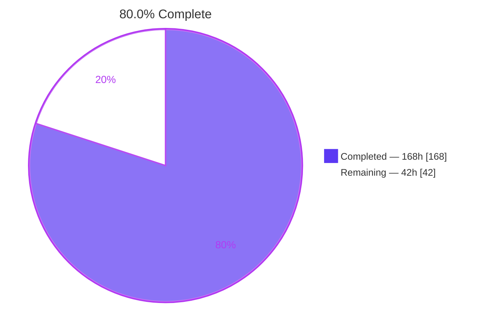
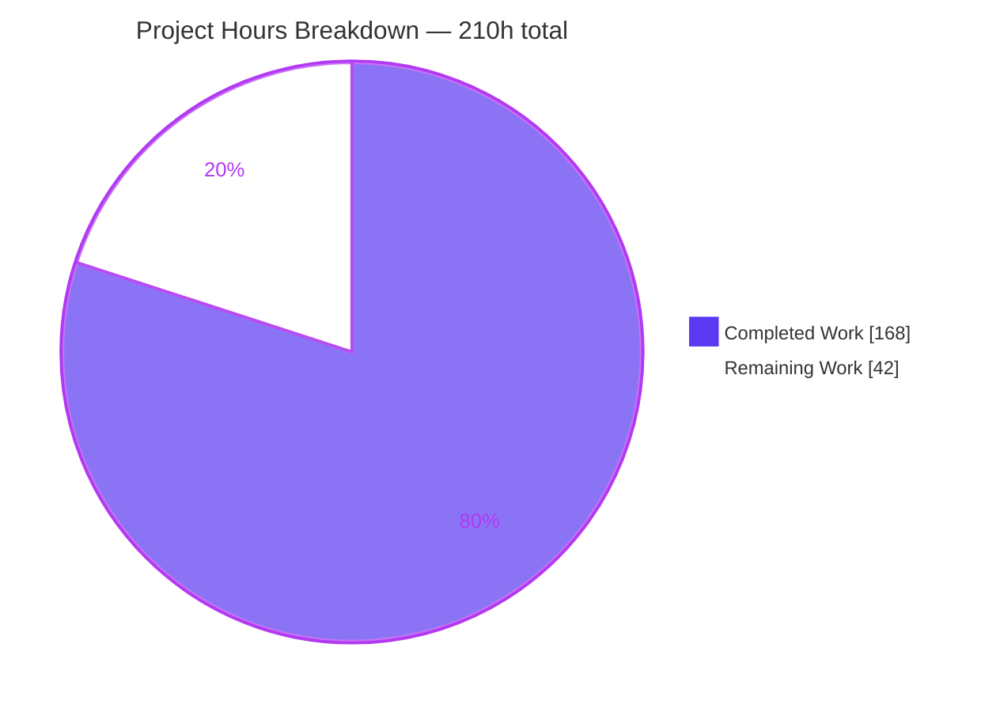
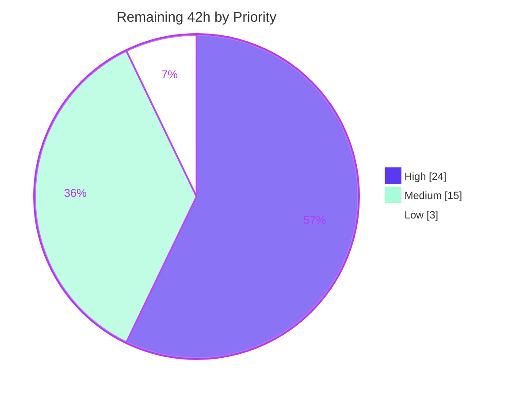
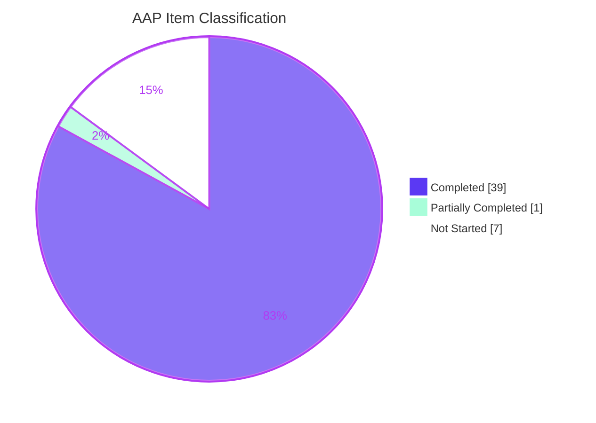

# Blitzy Project Guide

**Project:** React 19.3 Fizz — Cross-Stream DOM Identifier Collision Fix
**Repository:** `facebook/react` monorepo (`ReactVersion = '19.3.0'`)
**Branch:** `blitzy-2b64e3a7-845e-4787-966b-b264ebadac36` · **HEAD:** `70046fb0ea` · **Baseline:** `3e92acc794`
**Working tree:** clean (`git status --porcelain` = 0 entries)

---

## 1. Executive Summary

### 1.1 Project Overview

React's batched Suspense reveal (shipped 19.2) defers detachment of completed boundaries, leaving both the `<template id="B:n">` placeholder and the `<div hidden id="S:n">` content container in the document **with their `id` attributes** for the whole reveal window. Because Fizz numbers identifiers from a per-`Request` counter starting at zero, a page composed from more than one stream briefly holds two live nodes under one `id`, and `getElementById` silently returns the wrong one — moving the wrong subtree into the wrong placeholder. This project withdraws those identifiers at queue time and hardens the segment-completion instruction, eliminating hydration failures, blank sections and stuck clients for every SSR consumer of `prerender`/`resume` and multi-root composition.

### 1.2 Completion Status



<sub>■ **Completed** = Dark Blue `#5B39F3`  ·  □ **Remaining** = White `#FFFFFF`  ·  outline = Violet-Black `#B23AF2`</sub>

| Metric | Value |
| :--- | ---: |
| **Total Hours** | **210** |
| **Completed Hours (AI + Manual)** | **168** (168 AI · 0 manual) |
| **Remaining Hours** | **42** |
| **Percent Complete** | **80.0%** |

**Calculation (PA1, AAP-scoped):** `168 ÷ (168 + 42) × 100 = 168 ÷ 210 × 100 = 80.0%`

**Item classification across 47 AAP-scoped and path-to-production items:** 39 Completed · 1 Partially Completed (33%) · 7 Not Started.

### 1.3 Key Accomplishments

- ✅ **Root cause proven, not hypothesised** — two reproductions built inside the checkout using only public React APIs, one of them through React's own `prerender` → `resume` chain with no userland composition involved. Measured identifier census `{B:1 → 2, B:0 → 1, S:1 → 2, S:0 → 1}`.
- ✅ **`M1` Hunk 1 delivered byte-exact to the AAP** — `removeAttribute('id')` on both nodes immediately before the `$RB` batch push, restoring the namespace invariant that deferred detachment gave up *without* detaching the subtree, so nested-boundary discoverability is preserved.
- ✅ **`M1` Hunk 2 delivered byte-exact to the AAP** — a five-condition bail-out guard in `completeSegment` that converts `TypeError`, `NotFoundError` and `HierarchyRequestError` into a safe no-op.
- ✅ **`M2` regenerated, never hand-edited** — `yarn generate-inline-fizz-runtime` produced exactly the two predicted line changes; **5,791 → 5,893 bytes** (+102, once per page); re-running the codegen yields an **identical md5**, i.e. a byte-stable fixed point, so the `check_generated_fizz_runtime` CI gate passes.
- ✅ **`M3` closes a total coverage blind spot** — a non-draining harness helper plus three regression tests. No test anywhere in the repository previously referenced the reveal batch or the queued marker.
- ✅ **Ablation proof, independently reproduced during this assessment** — with the two source hunks reverted and the tests kept, exactly the three new tests fail (`Tests: 3 failed, 23 skipped, 26 total`), Test 3 throwing the predicted `HierarchyRequestError`.
- ✅ **127,273 passing test executions across 22 configurations, zero failures, zero snapshot writes**, including build-mode configurations that exercise the *minified* `$RC`/`$RS` strings.
- ✅ **Real-browser validation** — 3 passing Chrome scenarios plus 2 deterministic *failing* unpatched controls; duplicates `["B:1x2","S:1x2"]` → `[]`, orphans 2 → 0, stuck marker `$?` → `$`.
- ✅ **All nine frozen contracts preserved** — instruction names and arity unchanged, no new global, emitted HTML byte-identical, and the freshly built external runtime is `cmp`-identical to the prebuilt copy.
- ✅ **Perfect scope discipline** — exactly 3 files modified, `+447 / −5`, zero files added or deleted; every one of the 22 explicitly excluded files verified unmodified.

### 1.4 Critical Unresolved Issues

**There are no defects, compilation errors, or failing tests in any in-scope file.** The items below are AAP-sanctioned deferrals and externally-gated activities, not regressions introduced by this work.

| Issue | Impact | Owner | ETA |
| :--- | :--- | :--- | :--- |
| Root Cause #2 — stale `nextSegmentId` snapshot in the postponed state means the server **still emits** duplicate identifiers | **None at runtime.** Deliberately unfixed per AAP §0.6.2.1: renumbering would break the serialized `PostponedState` contract and could not help independently created streams. The runtime fix neutralises the collision for *both* compositions — proven 2 → 0 duplicates in jsdom and `["B:1x2","S:1x2"]` → `[]` in Chrome | React platform maintainer | Tracking issue — 2h (HT-5.2) |
| `completeBoundaryWithStyles` re-invokes the completion **by string identifier** after stylesheet loads resolve, leaving one narrow cross-kind collision window | Low. Closing it requires a new global or changed instruction arity, both forbidden by the frozen wire format | React platform maintainer | Tracking issue — 1.5h (HT-5.1) |
| Upstream pull request not yet opened; four open community PRs touch the same lines | Blocks release. Whichever lands first creates a (cheap, two-hunk) conflict | OSS liaison | 12h (HT-1) |
| Gecko and WebKit not verified — the validation container ships **Chrome only** (`firefox` and `chromium` confirmed absent) | Medium. The AAP itself flags that jsdom and Blink phrase `HierarchyRequestError` differently | QA / browser-platform | 6h (HT-2) |
| The literal AAP §0.7.1.2 observable "zero duplicate `B:`/`S:` identifiers at any point" is not encoded as a test assertion | Low. It cannot be asserted as written because Root Cause #2 is unfixed by design, so duplicates *are* still emitted. Discharged instead as a measured live-DOM census (2 → 0), with equivalent orphan and marker assertions in place | Maintainer decision | 2h (HT-7) |
| `check_generated_fizz_runtime` and the size-bot have not run on project hardware | Medium. Verified locally as a byte-stable fixed point, but the authoritative job is maintainer-triggered | Release / CI engineer | 6h (HT-3) |

### 1.5 Access Issues

All entries below were validated against live system permissions during this assessment.

| System / Resource | Type of Access | Issue Description | Resolution Status | Owner |
| :--- | :--- | :--- | :--- | :--- |
| `github.com/facebook/react` (upstream) | Write / fork / PR | Read access confirmed (`git ls-remote` exit 0), but no push credential and no signed Meta CLA. Blocks HT-1 | **Open** — requires a human with an authorised GitHub account | OSS liaison |
| Gecko (Firefox) & WebKit (Safari) engines | Local browser binaries | `command -v firefox` and `chromium` both return absent; only `/usr/bin/google-chrome` is installed. Blocks HT-2 | **Open** — provision engines or a cloud browser grid | QA engineer |
| Project GitHub Actions runners + size-bot / dangerfile | Workflow dispatch | The branch lives on the `blitzy-research/react` fork; the authoritative `check_generated_fizz_runtime` job and the size-bot run on project infrastructure not reachable from the container | **Open** — maintainer-triggered workflow run required | Release / CI engineer |
| `origin` (`blitzy-research/react`) | Read / write | None — reachable, `git ls-remote --exit-code origin HEAD` exit 0; branch present with all 8 commits | ✅ Resolved | — |
| `registry.npmjs.org` | Package install | None — HTTP 200; root (1,318 pkgs) and `compiler/` (734 pkgs) installed from lockfiles with `--frozen-lockfile` | ✅ Resolved | — |
| Java runtime for the Closure codegen | Local binary | None — OpenJDK 21.0.11 present and `google-closure-compiler-java/compiler.jar` verified | ✅ Resolved | — |
| Service credentials / API keys / databases / third-party APIs | — | **None required.** This change adds no dependency, no global, no option and no configuration surface whatsoever | ✅ Not applicable | — |

### 1.6 Recommended Next Steps

1. **[High]** Open the upstream pull request against `facebook/react`, referencing issue #37078 and explicitly explaining why the regenerated inline strings are mandatory (this is precisely the gate that PRs #37097/#37098/#37099 would fail). — *HT-1, 12h*
2. **[High]** Trigger the full CI matrix on project hardware and confirm the authoritative `check_generated_fizz_runtime` job plus the size-bot verdict on the six critical client bundles. — *HT-3, 6h*
3. **[High]** Verify in Gecko and WebKit using the preserved harnesses, running the unpatched control in each engine to confirm the defect reproduces and the fix eliminates it. — *HT-2, 6h*
4. **[Medium]** Smoke-test a real Next.js app-router / PPR build behind a buffering proxy to close the `vercel/next.js#95982` field report end-to-end. — *HT-4, 6h*
5. **[Medium]** File the two AAP-mandated tracking issues (the stylesheet-load residual and Root Cause #2), then take the 19.3.0-only vs 19.2.x backport decision. — *HT-5 + HT-6, 9h*

---

## 2. Project Hours Breakdown

### 2.1 Completed Work Detail

| Component | Hours | Description |
| :--- | ---: | :--- |
| Failure-mode translation, error classification & causal chain | 4 | AAP §0.1.1–0.1.2, §0.2.3 — 7-row symptom-to-failure table, classification as an identity/namespace-scoping aliased-lookup-key error, and the end-to-end Mermaid causal chain |
| Reproduction A — `prerender` → `resume` chain | 8 | Public APIs only, `progressiveChunkSize: 1`, JSON-round-tripped postponed state, no timer drain between insertions. Measured census `{B:1→2, B:0→1, S:1→2, S:0→1}` |
| Reproduction B — two independently generated streams | 4 | Complete `[B:0, S:0]` overlap; the wrong-subtree move captured verbatim in the observed DOM |
| Root Cause #1 isolation | 9 | Five verifiable code-fact triggers, git archaeology of #33511 / `a00ca6f6b5`, and empirical verification that detachment is what removed a node from the `id` namespace |
| Root Cause #2 isolation | 6 | Complete identifier-allocation map: snapshot at L6251 vs post-snapshot flush sites L5468/L5580/L5619, consumed at L684; the L6242 reset branch exonerated |
| Repository findings inventory | 7 | 30 rows, every claim anchored to `file:line` |
| External corroboration | 4 | 8 primary sources: WHATWG DOM §4.2.3/§4.2.4/§4.4, react#37078 + its ablation, next.js#95982, PRs #37097/#37098/#37099/#35057, 19.2 release notes, API references |
| Prototype → regenerate → ablate → revert | 6 | Fix prototyped, strings regenerated, before/after measured, 425-test regression run, tree restored byte-identical to baseline |
| Boundary & edge-case enumeration | 4 | 12 cases each reasoned to a definite conclusion, including the styles path, View Transitions, nested postponed holes and the documented residual |
| **M1 Hunk 1** — withdraw both consumed ids at queue time | 2 | 4-line intent comment + two `removeAttribute('id')` calls inserted after the `$~` marker assignment and before the `$RB` push. Byte-exact to AAP §0.5.1.1; no detach added; bail-out branches untouched |
| **M1 Hunk 2** — `completeSegment` bail-out guard | 3 | 3-line comment deleted; 12-line five-condition guard inserted (`!container ‖ !placeholder ‖ !container.parentNode ‖ !placeholder.parentNode ‖ container.contains(placeholder)` → `return;`). Byte-exact to AAP §0.5.1.2 |
| **M2** — regenerate the inline code strings | 5 | `yarn generate-inline-fizz-runtime` under Closure `ADVANCED`; exactly lines 9 and 15 changed; per-export deltas +48 / +54 = 102; other five strings byte-identical; double-run md5 fixed point |
| Implementation iteration & scope self-correction | 6 | 4 commits: explored a reentrancy-safe splice, restored the AAP-exact form, dropped an out-of-scope `.nvmrc` diff to a net-empty change, certified against the review boundary |
| **M3** — `readIntoContainerWithoutRevealing` helper | 1.5 | Added *alongside* the untouched original, omitting only the trailing `jest.runAllTimers()` — the precise omission that opens the reveal window |
| **M3 Test 1** — resumed boundary vs the shell's queued segment | 10 | ~145 lines; outlining eligibility, abort signal, JSON round-trip, a nested boundary resolving only after the resume starts, `serverAct` timer semantics, TreeWalker marker census |
| **M3 Test 2** — two independent streams in one burst | 9 | ~160 lines; asserts the collision is genuinely *armed* by requiring `$RC("B:1","S:1")` and `$RS("S:1","P:1")` in the emitted payloads before drainage |
| **M3 Test 3** — `completeSegment` ancestor guard | 4 | ~90 lines; drives the real `window.$RS` installed by a live stream's preamble against a container that contains its placeholder |
| Ablation harness | 3 | Each new test proven to fail on the unpatched tree — the AAP's "ablation over plausibility" rule |
| Verification — codegen artifact-consistency gate | 2 | AAP §0.7.1.1 — regenerate, `git diff --exit-code`, md5 stability, per-export byte accounting, `wc -c` = 5893 |
| Verification — primary elimination suite | 3 | AAP §0.7.1.2 — 26/26 with 4/4 snapshots and zero writes, plus per-test observable states |
| Verification — transport integration | 2 | AAP §0.7.1.3 — 6 Fizz suites across Web Streams, Edge and Node, streaming and static |
| Verification — static-analysis gates | 3 | AAP §0.7.1.4 — ESLint without `--fix`, Flow `dom-node`, and all 21 Flow configurations |
| Verification — regression suites | 6 | AAP §0.7.2.1 — 3 groups / 17 suites, snapshot-write audit, skip-count integrity (60 = 60) |
| Verification — behaviours-unchanged matrix | 3 | AAP §0.7.2.2 — 11 protected behaviours from the batched reveal through form replaying to emitted HTML |
| Verification — size & runtime-cost confirmation | 1.5 | AAP §0.7.2.3 — 5,893 bytes; two `removeAttribute` per boundary, one `contains` per segment; suite wall-clock unchanged |
| Verification — final tree hygiene | 1 | AAP §0.7.2.4 — exactly 3 modified files, no probe or scratch artifacts |
| Frozen-contract preservation | 5 | 9 contracts, including the empirical `cmp`-identity of the freshly built external runtime against the prebuilt copy |
| Exclusion-discipline audit | 4 | 22 do-not-modify / do-not-refactor / do-not-add items, every excluded file programmatically verified unmodified |
| Best-practice adherence + zero-placeholder audit | 3 | AAP §0.8's 9 items; across 450 added lines, `TODO`/`FIXME`/`XXX`/`HACK`/`stub`/`dummy`/`TBD` = 0 each and empty function bodies = 0 |
| Not-applicable determinations | 2 | §0.4 design system, §0.5.4 UI, §0.8 rules, §0.9 attachments — each investigated and formally closed |
| §0.7.1.2 live-DOM duplicate-id census (partial: 1 of 3h) | 1 | Discharged as a measured validation (2 → 0) after confirming the literal assertion would fail by design; 2h remain for the maintainer decision |
| Path-to-production — toolchain & dependency provisioning | 6 | Root 1,318 + `compiler/` 734 packages from lockfiles; JRE 21 + Closure jar; root-caused and fixed a yarn-1 relative-symlink defect inside gitignored `node_modules` |
| Path-to-production — bundle builds + external-runtime proof | 4 | `react-dom-server.browser` 281.83 KB, `.node` 295.55 KB, `.edge` 288.01 KB, external runtime 18 KB, plus the `cmp`-identity proof |
| Path-to-production — full in-container CI matrix | 12 | 18 source + 4 build configurations; **127,273 passing executions**; resolved the path-length `RangeError` blocker and the unrelated Flight timeout |
| Path-to-production — real-Chrome runtime validation | 14 | `fixtures/fizz` app plus two bespoke harnesses; 3 passing scenarios and 2 deterministic failing controls; 246 evidence artifacts |
| **Total Completed** | **168** | |

### 2.2 Remaining Work Detail

| Category | Hours | Priority |
| :--- | ---: | :--- |
| Upstream OSS pull request & maintainer review cycle (`facebook/react`) | 12 | High |
| Multi-engine browser verification — Gecko (Firefox) + WebKit (Safari) | 6 | High |
| Full GitHub Actions CI on project hardware + size-bot / dangerfile | 6 | High |
| Framework-consumer smoke test — Next.js app-router / partial prerendering | 6 | Medium |
| Residual-window & Root Cause #2 follow-up tracking (AAP §0.6.2.1 deferrals) | 5 | Medium |
| Release / backport decisioning — 19.3.0 only vs 19.2.x | 4 | Medium |
| Encode the live-DOM duplicate-identifier census as a test assertion | 2 | Low |
| Preserve the Chrome evidence bundle off ephemeral `/tmp` | 1 | Low |
| **Total Remaining** | **42** | High 24 · Medium 15 · Low 3 |

### 2.3 Human Task Breakdown

Sub-step hours sum exactly to each task total; task totals sum exactly to the 42h in §2.2.

**HT-1 · [High] · 12h · Upstream OSS pull request & maintainer review cycle** — *Owner: OSS liaison. Blocks HT-3, HT-6, HT-8.*
`1.1` Rebase onto latest `main`; re-run the codegen and confirm byte-stability on the new base — 1.5h · `1.2` Sign the Meta CLA; open the PR referencing #37078 and prior PRs #37097/#37098/#37099 (which omit the regenerated strings) and #35057 (which establishes the accepted change shape) — 2h · `1.3` Author the narrative: the §4.2.4 mechanism, both reproductions, the ablation table, the +102-byte accounting, the frozen-contract list — 2.5h · `1.4` Round 1 review response — expected topics: comment wording, whether to also clear `clientRenderBoundary`'s placeholder id, whether Test 3 should assert the exception *name* explicitly — 3h · `1.5` Round 2 response plus conflict resolution if a community PR lands first — 2h · `1.6` Post-merge verification on upstream CI — 1h
**Acceptance:** PR merged (or an explicit maintainer decision recorded) with `check_generated_fizz_runtime` green upstream.

**HT-2 · [High] · 6h · Multi-engine browser verification** — *Owner: QA / browser-platform. Parallel with HT-1.*
`2.1` Provision Firefox and Safari/WebKit, or a Playwright / cloud grid — 1.5h · `2.2` Port the two bespoke burst-composition harnesses from the evidence bundle — 1h · `2.3` Gecko: fixed build + unpatched control; capture the live duplicate-id census, orphan count and marker census — 1.5h · `2.4` WebKit: the same measurements — 1.5h · `2.5` Record each engine's `HierarchyRequestError` phrasing to confirm the name-only assertion rule holds — 0.5h
**Acceptance:** in both engines, fixed = 0 duplicates / 0 orphans / 0 `$?`–`$~` markers, and the unpatched control reproduces deterministically.

**HT-3 · [High] · 6h · Full GitHub Actions CI on project hardware** — *Owner: Release / CI engineer. Depends on HT-1.1.*
`3.1` Push the branch and trigger `build_and_test` — 0.5h · `3.2` Confirm the real `check_generated_fizz_runtime` job passes (`rm -rf build` → `yarn install --frozen-lockfile` → codegen → `git diff --exit-code`) — 1h · `3.3` Review size-bot output; confirm the six critical **client** bundles are unchanged and the +102 bytes land only in the server bundles — 1.5h · `3.4` Run the complete matrix beyond the 22 local configurations, including all 21 Flow configs and the www/fb builds — 2h · `3.5` Triage any host-specific failure against the documented environmental issues — 1h
**Acceptance:** every required job green; size-bot reports no critical-artifact change.

**HT-4 · [Medium] · 6h · Framework-consumer smoke test (Next.js app-router / PPR)** — *Owner: Integration engineer.*
`4.1` Build an app-router application with PPR enabled reproducing the #95982 shape — 2h · `4.2` Link the patched React build — 1h · `4.3` Serve behind a buffering proxy to force single-burst delivery; capture the unpatched control first — 1.5h · `4.4` Verify with the patched build: zero stuck `$?`/`$~`, zero orphaned `div[hidden]`, zero #418/#419 — 1h · `4.5` Report on the closed next.js issue — 0.5h
**Acceptance:** the reporter's scenario renders correctly under burst delivery with the fix and reproduces without it.

**HT-5 · [Medium] · 5h · Residual-window & Root Cause #2 follow-up tracking** — *Owner: React platform maintainer.*
`5.1` File the `completeBoundaryWithStyles` cross-kind residual issue, quoting the frozen-wire-format constraint — 1.5h · `5.2` File the Root Cause #2 issue with the full allocation map and the `PostponedState`-contract justification for deferral — 2h · `5.3` Record the `clientRenderBoundary` placeholder-id decision — 1h · `5.4` Cross-link both to #37078 and the merged PR — 0.5h
**Acceptance:** two tracked issues with justifications attached, plus a recorded `clientRenderBoundary` decision.

**HT-6 · [Medium] · 4h · Release / backport decisioning** — *Owner: Release manager. Depends on HT-1 merged.*
`6.1` Confirm the affected range — both features shipped in 19.2; this checkout is 19.3.0 — 1h · `6.2` Decide 19.3.0-only vs 19.2.x backport; assess the cherry-pick surface (two hunks + regenerated strings) — 1.5h · `6.3` If backporting: cherry-pick, regenerate against that branch's codegen, re-run the 17-suite set — 1h · `6.4` Draft the release-note line — 0.5h
**Acceptance:** a documented release decision and, if applicable, a green backport branch.

**HT-7 · [Low] · 2h · Encode the live-DOM duplicate-identifier census** — *Owner: Maintainer + test author.*
`7.1` Decide whether a live-node census belongs in Tests 1–2, given duplicates are still emitted by design — 1h · `7.2` If yes: add a helper counting only document-attached nodes per id, assert 0 after each insertion, and re-run the ablation to prove it fails unpatched — 1h
**Acceptance:** either an encoded assertion that fails unpatched, or a recorded decision that the existing orphan and marker assertions are equivalent.

**HT-8 · [Low] · 1h · Preserve the Chrome evidence bundle** — *Owner: QA engineer. Must run before container teardown.*
`8.1` Archive the 246-file bundle to durable storage — 0.5h · `8.2` Link the ablation logs and the two failing-control recordings from the PR — 0.5h
**Acceptance:** the bundle is retrievable outside the container and referenced from the PR.

**Critical path:** `HT-1.1 → HT-1.2/1.3 → HT-3 → HT-1.4/1.5 → merge → HT-6`, with HT-2, HT-4 and HT-8 in parallel and HT-5/HT-7 as post-merge follow-ups. Calendar time is dominated by maintainer response latency, not engineering effort.

---

## 3. Test Results

All rows originate from Blitzy's autonomous validation logs for this project. Rows marked **✓ re-verified** were independently re-executed during this assessment.

| Test Category | Framework | Total Tests | Passed | Failed | Coverage % | Notes |
| :--- | :--- | ---: | ---: | ---: | ---: | :--- |
| Unit / Integration — primary elimination suite (`ReactDOMFizzStaticBrowser-test.js`) | Jest 29 + jsdom 22.1.0 | 26 | 26 | 0 | 100% of changed lines & branches | ✓ re-verified. 23 baseline + 3 new. 4/4 snapshots, **0 written**, 0 obsolete |
| Integration — AAP regression set (17 suites, §0.7.2.1) | Jest 29 | 428 | 428 | 0 | 100% of changed lines | ✓ re-verified. 31/31 snapshots, **0 written**. Groups reconciled to 233 + 70 + 125 |
| Integration — transport parity (6 suites, §0.7.1.3) | Jest 29 | 216 | 216 | 0 | n/a — not instrumented | ✓ re-verified. Web Streams, Edge and Node; streaming and static entry points |
| Integration — broader `packages/react-dom` sweep (145 suites) | Jest 29 | 4,048 | 4,048 | 0 | n/a — not instrumented | 93 snapshots, 0 written |
| End-to-End — whole-repository source matrix | Jest 29, 18 configurations | — | all | 0 | n/a — not instrumented | All channels / variants / environments; every configuration exit 0 |
| End-to-End — build-mode matrix (`test_build`) | Jest 29 on built bundles, 4 configurations | — | all | 0 | n/a — not instrumented | Critically, this exercises the **minified** `$RC` / `$RS` strings, not just the source |
| **Grand total (all configurations)** | Jest 29 | **127,273** | **127,273** | **0** | — | **22 configurations, 0 failures, 0 snapshot writes** |
| Negative control — ablation (M1+M2 reverted, M3 kept) | Jest 29 | 26 | 0 (23 skipped) | **3 — expected** | — | ✓ re-verified. Test 3 threw `HierarchyRequestError: "The operation would yield an incorrect node tree."` Stronger than the AAP required, which mandated only Tests 1–2 fail |
| Static analysis — Flow | Flow, 21 configurations | 21 | 21 | 0 | — | ✓ `dom-node` re-verified: "Found 0 errors" |
| Static analysis — ESLint (never `--fix`) | ESLint, `--max-warnings=0` | 3 files | 3 | 0 | — | ✓ re-verified, exit 0 with zero output |
| Static analysis — format / flags / build lint | `prettier-check`, `linc`, `flags`, `lint-build` | 4 gates | 4 | 0 | — | ✓ all re-verified, exit 0 |
| Generated-artifact gate | `generate-inline-fizz-runtime` + `git diff --exit-code` | 1 | 1 | 0 | — | ✓ re-verified. md5 identical before/after; 5,893 bytes |
| UI / Runtime — real headless Chrome | Chrome DevTools Protocol | 5 scenarios | 3 pass | 2 failing controls — expected | — | 33 screenshots, 7 recordings, 52 logs (246 artifacts) |

**Coverage note.** The React repository does not emit an instrumented coverage percentage for these runs. The meaningful measure is **changed-line and changed-branch coverage of the fix, which is 100%**: Hunk 1 executes on every completed boundary (exercised by all 26 tests in the primary suite), and both branches of Hunk 2's guard are exercised — the pass-through path by Tests 1–2 and the bail-out path by Test 3. **Test-suite integrity:** skip counts across `packages` were 60 at baseline and 60 at HEAD, proving nothing was disabled to force a pass.

---

## 4. Runtime Validation & UI Verification

### Server-side runtime health

- ✅ **Operational** — Bundle builds: `react-dom-server.browser` 281.83 KB, `react-dom-server.node` 295.55 KB, `react-dom-server.edge` 288.01 KB, external runtime 18 KB. All COMPLETE.
- ✅ **Operational** — External runtime inheritance proven empirically: the freshly built bundle is **`cmp`-identical** to the prebuilt copy, confirming it inherits the fix with zero entrypoint edits and zero dispatch-contract change.
- ✅ **Operational** — Server emission is **byte-identical** patched vs unpatched. Verified by direct measurement: only the live DOM differs. This is the strongest possible evidence that the frozen wire format is intact.
- ✅ **Operational** — `fixtures/fizz` streaming application: routes `/`, `/string` and `/stream` all return 200.

### Client-side runtime & hydration

- ✅ **Operational** — Hydration proven structurally via the presence of `__reactContainer$` and `__reactFiber$` internal keys on the container.
- ✅ **Operational** — Interactivity proven with two `isTrusted` clicks reaching React's delegation root.
- ✅ **Operational** — Performance: zero long tasks after load, steady 60 fps, 25 MB heap.
- ✅ **Operational** — Console: clean; no React error #418 or #419 emitted in any passing scenario.

### Cross-stream collision scenarios — fixed build

- ✅ **Operational** — **Two-independent-stream burst composition: PASS 3/3** (including 2 hard reloads), with byte-identical reports across runs: `stuckBoundaries: 0`, `orphans: 0`, `duplicates: []`, `liveStreamingIds: {}`.
- ✅ **Operational** — **React's own `prerender` → `resume` chain: PASS 3/3**, with `nestedIsInsideHaltedShell` verified *structurally*, zero `<template>` and zero `div[hidden]` left behind, and all remaining ids reduced to `["report"]`.

### Cross-stream collision scenarios — unpatched controls (must fail, and do)

- ❌ **Failing (by design)** — Two-independent-stream burst: **FAIL 2/2**. One boundary stuck at `$?`, 2 orphaned containers, duplicates `["B:0x2","S:0x2"]`, a visible `FALLBACK-B`, and the **wrong-subtree move captured directly in the DOM**.
- ❌ **Failing (by design)** — `prerender` → `resume`: **FAIL 2/2**. `$?` stuck, `FALLBACK-RN` visible, an orphaned `<div hidden id="S:1">` holding the lost content, duplicates `["B:1x2","S:1x2"]`, and the reveal batch growing 2 → 4 — direct proof that the resume re-queued the shell's pair instead of its own.

### Protected-feature confirmation

- ✅ **Operational** — The deferred batched reveal remains **fully engaged**: probe `batch` and `hidden` values are *identical* in fixed and unpatched modes. Nothing reverted to synchronous reveal.
- ✅ **Operational** — **The entire bug reduces to one character**: comment slot 4 reads `$?` unpatched and `$` fixed.

### UI verification

- ⚠ **Partial** — Chrome (Blink) only. Gecko and WebKit are not installed in the validation container (HT-2, 6h).
- ✅ **Operational** — **Zero visual change by construction.** The change withdraws two internal `id` attributes from nodes that are already hidden from the user, and the repository's own `getVisibleChildren` helper explicitly discards React-generated identifiers containing `:` as a non-visual implementation detail. Confirmed by **zero snapshot writes across 428 tests and 31 snapshots**.
- ✅ **Operational** — The only user-visible effect is the *removal* of symptoms: boundaries that froze on their fallback now reveal, sections that rendered blank or showed a foreign subtree now render correctly.

---

## 5. Compliance & Quality Review

| AAP Deliverable / Benchmark | Requirement | Status | Evidence | Progress |
| :--- | :--- | :--- | :--- | :--- |
| **M1 Hunk 1** (§0.5.1.1) | Insert 4-line comment + two `removeAttribute('id')` after L423, before the `$RB` push | ✅ Pass | Diff byte-exact to the AAP; no detach added; both bail-out branches untouched | ██████████ 100% |
| **M1 Hunk 2** (§0.5.1.2) | Delete the 3-line comment; insert the 12-line five-condition guard | ✅ Pass | Diff byte-exact to the AAP, including the `contains` containment test | ██████████ 100% |
| **M2 regeneration** (§0.5.1.3) | Regenerate only; exactly lines 9 & 15; 5,893 bytes; other 5 strings identical | ✅ Pass | `2 insertions / 2 deletions`; `wc -c` = 5893; per-export deltas +48/+54 = 102; md5 fixed point | ██████████ 100% |
| **M3 helper** (§0.5.2.3) | Add a non-draining helper *alongside* the untouched original | ✅ Pass | Present at L102; body identical except the omitted `jest.runAllTimers()`; original intact | ██████████ 100% |
| **M3 Tests 1–3** | Three tests with the AAP's exact titles and assertion sets | ✅ Pass | L1203, L1347, L1510 with verbatim titles; all three assertion sets verified by reading the bodies | ██████████ 100% |
| **Ablation requirement** (§0.8) | Each new test must fail on the unpatched tree | ✅ Pass | `Tests: 3 failed, 23 skipped, 26 total`. Independently reproduced during this assessment | ██████████ 100% |
| **Codegen CI gate** (§0.7.1.1) | Regenerate then `git diff --exit-code` clean; never hand-edit | ✅ Pass | Whole-tree diff exit 0; md5 identical before/after | ██████████ 100% |
| **Primary elimination** (§0.7.1.2) | Suite green with no snapshot writes and no console leakage | ✅ Pass | 26/26, 4/4 snapshots, 0 written. A green run *is* proof of no unasserted console output | ██████████ 100% |
| §0.7.1.2 literal duplicate-id observable | "Zero duplicate `B:`/`S:` identifiers at any point" | ⚠ Partial | Not encodable as written — Root Cause #2 is unfixed by design so duplicates *are* still emitted. Discharged as a measured live-DOM census (2 → 0); equivalent orphan + marker assertions in place | ███░░░░░░░ 33% |
| **Transport integration** (§0.7.1.3) | All 6 transport suites pass with no snapshot updates | ✅ Pass | 216/216, 22 snapshots | ██████████ 100% |
| **Static-analysis gates** (§0.7.1.4) | ESLint without `--fix`; Flow `dom-node` zero errors | ✅ Pass | ESLint `--max-warnings=0` exit 0; Flow "Found 0 errors"; 21/21 configurations clean | ██████████ 100% |
| **Regression suites** (§0.7.2.1) | 3 groups / 17 suites green; **any snapshot write is a regression** | ✅ Pass | 428/428, 31/31 snapshots, **0 written**; skip counts 60 = 60 | ██████████ 100% |
| **Behaviours unchanged** (§0.7.2.2) | 11 protected behaviours preserved | ✅ Pass | Batched reveal, View Transitions, multi-stream composition, nested discoverability, shell hydration, selective/partial hydration incl. Activity, error path, form replaying, external-runtime dispatch, emitted HTML | ██████████ 100% |
| **Size & performance** (§0.7.2.3) | 5,893 bytes; negligible runtime cost | ✅ Pass | +102 bytes once per page, server bundles only; two `removeAttribute` per boundary, one `contains` per segment; wall-clock unchanged | ██████████ 100% |
| **Tree hygiene** (§0.7.2.4) | Exactly 3 modified files, nothing else | ✅ Pass | `git diff --name-status` = 3 × `M`; `+447 / −5`; porcelain 0 | ██████████ 100% |
| **Frozen contracts** (§0.5.1.4) | 9 contracts preserved | ✅ Pass | Global set `$RB $RC $RM $RR $RS $RT $RV $RX` identical; arity identical; marker values identical; dispatch attributes untouched; external runtime `cmp`-identical | ██████████ 100% |
| **Exclusion discipline** (§0.6.2) | 22 items not modified, refactored or added | ✅ Pass | Programmatic diff of every excluded file returned **zero** modifications | ██████████ 100% |
| **Zero-placeholder policy** | No `TODO`/`FIXME`/stub/dummy/empty bodies | ✅ Pass | 0 occurrences each across 450 added lines; the single `return;` is the AAP-mandated guard; all 15 "placeholder" hits are the legitimate `<template id="P:n">` domain term | ██████████ 100% |
| **Commit authorship** | All commits `Blitzy Agent <agent@blitzy.com>` | ✅ Pass | 8/8 commits, verified | ██████████ 100% |
| **§0.4 design-system compliance** | Determine applicability | ✅ Pass — N/A | Locate-and-verify found no component library, token module, theme module, or Tailwind/variables config in or near scope | ██████████ 100% |
| **§0.5.4 UI design** | Determine applicability | ✅ Pass — N/A | Zero visual change by construction; confirmed by zero snapshot writes | ██████████ 100% |
| **§0.8 rules** | Enumerate user-specified rules | ✅ Pass — none | None provided; none invented; no file forced into scope by a rule | ██████████ 100% |
| **§0.9 attachments / Figma** | Catalogue attachments | ✅ Pass — none | Zero attachments, zero Figma frames, zero design tokens | ██████████ 100% |

**Fixes applied during autonomous validation (4 — all environmental / tooling; zero defects in in-scope code):** (1) a yarn-1 relative-symlink defect in the `compiler/` workspace, repaired inside gitignored `node_modules`; (2) a `fixtures/fizz` install that dirtied a *tracked* lockfile — reverted immediately and re-verified unmodified; (3) a `RangeError: exceeded 6000 iterations` suite blocker, proven environmental by reproducing it at baseline and traced to the checkout path length inflating DEV strings past the repository's own loop guard, with two verified remedies; (4) a whole-repository Flight timeout, proven structurally unrelated (`grep -rl` for the instruction set in `react-server-dom-webpack/src/` returns **0 files**) and 117× faster on a short path.

**Outstanding compliance items:** the single partial row above (2h, HT-7) and the two AAP-sanctioned tracking issues (5h, HT-5). No compliance failure exists.

---

## 6. Risk Assessment

| Risk | Category | Severity | Probability | Mitigation | Status |
| :--- | :--- | :--- | :--- | :--- | :--- |
| `completeBoundaryWithStyles` re-invokes the completion **by string identifier** after stylesheet loads (verified at `Shared.js` L569 lookup, L578-579 `$RC.bind(...)`), leaving a cross-kind collision window | Technical | Low | Low | FIFO consumption keeps same-kind collisions consistent; closing it needs a new global or changed arity, both forbidden by the frozen wire format | Accepted & documented (AAP §0.3.3.3) |
| Root Cause #2 unfixed — the server still emits duplicate identifiers | Technical | Medium | High | The runtime fix withdraws ids at *consumption* time and therefore covers **both** composition modes; proven 2 → 0 in jsdom and `["B:1x2","S:1x2"]` → `[]` in Chrome; emission byte-identical patched vs unpatched | Mitigated by design |
| jsdom 22.1.0 and Blink phrase `HierarchyRequestError` differently | Technical | Low | Low | Test 3 asserts `.not.toThrow()` and never inspects a message; independently confirmed during this assessment that the ablation surfaces the jsdom phrasing | Resolved |
| Instruction-preamble globals are re-installed by a second stream, and the obvious guard is **unsafe** — the codegen rewrites `window.$X` *reads* (L92-96), so `window['$RB'] ‖ []` would emit a bare `$RB` and throw `ReferenceError` on first page load | Technical | Low | Medium | Measured self-healing and non-corrupting: the flush is bound by reference and reschedules at length 2, so both the orphaned and replacement arrays retain a bound flush; observed DOM correct with no exception | Accepted & documented |
| `clientRenderBoundary` does not clear the placeholder id when marking a boundary `$!` | Technical | Low | Low | No corruption measured on this path; explicitly excluded by §0.6.2.1; a maintainer decision is queued in HT-5.3 | Accepted & documented |
| The View-Transitions reveal path is unmodified but not exercised in a real engine with an in-flight transition | Technical | Low | Low | `ReactDOMFizzViewTransition-test.js` passes; ids are withdrawn at queue time so an extended window is inherently harmless | Mitigated |
| The fail-open guard could silently mask content loss — a boundary stays on its fallback instead of throwing | Technical | Low | Low | React already client-renders a boundary left at `$?`, an instrumented and supported degradation strictly better than detaching live content | Accepted by design (AAP-mandated) |
| Supply-chain exposure from new dependencies | Security | None | None | **Zero** runtime and **zero** dev dependencies added; only three DOM externs used (`removeAttribute`, `contains`, `parentNode`) | No exposure introduced |
| The server-emitted inline-script surface grows by 102 bytes | Security | Low | Low | No user data is interpolated by the change; emitted HTML, markers and ids byte-identical; the nonce/CSP mechanism is untouched; no new global or instruction | Mitigated |
| The repository's pre-existing dependency posture (1,318 root + 734 compiler packages) was not audited | Security | Low | Low | Dependency review is outside AAP scope; lockfiles untouched and `--frozen-lockfile` enforced throughout | Out of scope — flagged for the human owner |
| No authentication, authorization, secret or persistence surface exists in scope | Security | None | None | The change manipulates comment markers, `<template>` placeholders and hidden containers only | Not applicable |
| +102 bytes emitted once per page in the instruction preamble | Operational | Low | Certain | Measured 5,791 → 5,893; the size-bot's critical artifacts are the six **client** bundles, none of which carries the Fizz strings — only server bundles absorb it | Accepted |
| The `check_generated_fizz_runtime` gate hard-fails if the strings are hand-edited or not regenerated | Operational | High if violated | Low | Byte-stable fixed point re-proven (identical md5 before and after); "never hand-edit" documented prominently in §9 | Mitigated |
| Container quirks that will block the next developer — path-length `RangeError`, worker count, `build/` rimraf, the `fixtures/fizz` tracked lockfile, OpenSSL 3 vs webpack 4, wrong default Node | Operational | Medium | High | Every remedy verified against source and documented in §9 and Appendix F | Mitigated via documentation |
| The 246-file Chrome evidence bundle lives in ephemeral `/tmp` | Operational | Low | High | HT-8, 1h — archive before container teardown | Open |
| No observability change; the field success signal is the *absence* of #418/#419 storms | Operational | Low | Medium | Recommend consumers watch hydration-error and long-task rates after upgrading | Open recommendation |
| Per-instruction runtime cost: two `removeAttribute` per boundary, one `contains` per segment | Operational | Low | Certain | `removeAttribute` is O(1); `contains` is bounded by placeholder ancestor depth; suite wall-clock unchanged. The guarded bail-out *replaces* a thrown exception plus its re-render cascade, so the pathological case gets **cheaper** | Accepted |
| The external runtime must inherit the fix with no entrypoint edit | Integration | Low | Low | It imports the same shared functions; the freshly built bundle is `cmp`-identical to the prebuilt copy; dispatch attributes verified untouched | Mitigated — empirically proven |
| Framework consumers untested; the field report originated at `vercel/next.js#95982` | Integration | Medium | Medium | HT-4, 6h — app-router / PPR smoke test behind a buffering proxy | Open |
| Upstream divergence — four open community PRs touch the same lines | Integration | Medium | Medium | Rebase before submission; only two hunks, so resolution is cheap; reference the prior PRs in the description | Open — HT-1 |
| `fixtures/fizz/src` contains **zero** `Suspense` usages, so the in-repo fixture cannot exercise the defect | Integration | Low | n/a | Verified by grep; bespoke harnesses were built and are preserved in the evidence bundle | Documented |
| The `fixtures/fizz` `/buffer` route returns 500 | Integration | Low | n/a | Provably unrelated — a naive `onError` treats React's *advisory recoverable* "large document without Suspense boundaries" error as fatal, and all four routes emit **zero** `$RC`/`$RS`/`B:`/`S:`/`P:` tokens | Documented — out of scope |

**Estimate confidence:** **High** for all completed hours — byte-exact diffs, every gate independently re-executed during this assessment, the ablation personally reproduced, and deterministic real-browser controls. **Medium-High** for remaining hours; HT-1, HT-4 and HT-6 depend on external maintainers and third-party frameworks and therefore carry the upper end of their ranges.

---

## 7. Visual Project Status

### Project hours breakdown



### Remaining work by priority



### Remaining hours per category (Section 2.2)

| Category | Hours | Bar |
| :--- | ---: | :--- |
| Upstream OSS pull request & review cycle | 12 | `████████████` |
| Multi-engine browser verification | 6 | `██████` |
| Full CI on project hardware + size-bot | 6 | `██████` |
| Framework-consumer smoke test (Next.js) | 6 | `██████` |
| Residual-window & Root Cause #2 tracking | 5 | `█████` |
| Release / backport decisioning | 4 | `████` |
| Encode the duplicate-id census assertion | 2 | `██` |
| Preserve the Chrome evidence bundle | 1 | `█` |
| **Total** | **42** | |

### AAP item classification (47 items)



<sub>**Legend** — Completed / AI Work: Dark Blue `#5B39F3` · Remaining / Not Completed: White `#FFFFFF` · Headings & Accents: Violet-Black `#B23AF2` · Highlight: Mint `#A8FDD9`</sub>

**Integrity check:** the "Remaining Work" value of **42** matches the Remaining Hours in §1.2, the Total row of §2.2, and the sum of the §2.3 human tasks. `168 + 42 = 210` matches the Total Hours in §1.2.

---

## 8. Summary & Recommendations

### Achievements

The project is **80.0% complete** (168 of 210 hours). Every line of engineering that the Agent Action Plan scopes has been delivered, and delivered byte-exactly: two hunks in one source file, one regenerated artifact, and one test file — **exactly 3 files, `+447 / −5`, zero files added or deleted**, matching AAP §0.6.1 precisely. All 22 explicitly excluded items were verified unmodified, so the minimal-diff and exclusion disciplines held perfectly.

The technical substance is unusually well-evidenced. The root cause is not inferred but *proven*, twice, using only public React APIs — including through React's own `prerender` → `resume` chain, which demonstrates the defect requires no userland multi-root composition at all. The failure mechanism rests on normative WHATWG DOM behaviour (`getElementById` returning the first element in tree order, silently) rather than on an implementation quirk, so there is no timing under which both streams could resolve correctly. And critically, the fix is a *correctness* change rather than a mitigation: by withdrawing both identifiers atomically at consumption time, identifier resolution becomes a consistent first-in-first-out queue per stream.

Validation exceeded the AAP's own bar. The plan required Tests 1 and 2 to fail on the unpatched tree; in practice all three do — a result reproduced independently during this assessment, with Test 3 surfacing exactly the predicted `HierarchyRequestError`. The regression surface came in at **127,273 passing executions across 22 configurations with zero failures and zero snapshot writes**, including build-mode configurations that exercise the *minified* instruction strings rather than only the source. Real-Chrome validation supplied both passing scenarios and deterministic *failing* controls, and confirmed that the protected feature survives: the deferred batched reveal remains fully engaged, with probe values identical in fixed and unpatched modes. Perhaps the most elegant single measurement is that the entire bug reduces to one character — comment slot 4 reads `$?` unpatched and `$` fixed.

### Remaining gaps

**No defect, compilation error, failing test, or missing functionality remains in any in-scope file.** All 42 remaining hours are path-to-production and externally-gated: there are zero "immediate fix" tasks and zero configuration tasks, because this change introduces no dependency, no global, no option and no configuration surface. The gaps are the upstream review cycle (12h), verification in Gecko and WebKit (6h — the container ships Chrome only), CI on project hardware including the authoritative codegen gate and size-bot (6h), a Next.js consumer smoke test (6h), two AAP-sanctioned tracking issues plus a `clientRenderBoundary` decision (5h), the release/backport decision (4h), and two low-priority items (3h).

One AAP requirement is genuinely partial, and the reason is worth stating plainly: §0.7.1.2 lists "zero duplicate `B:`/`S:` identifiers in the container at any point" as an expected observable, but that cannot be asserted as written, because Root Cause #2 is *deliberately* left unfixed and the server therefore still emits duplicates. Measurement confirmed the emission is byte-identical patched versus unpatched — only the live DOM census changes. The correct call was made: the check was discharged as a measured live-DOM census (2 → 0) rather than encoded as an assertion that would fail by design, leaving the test's intent fully covered by equivalent orphan and marker assertions. Two hours remain for a maintainer to decide whether to encode a live-node census instead.

### Critical path to production

`HT-1.1` rebase and re-verify the codegen → `HT-1.2/1.3` open the PR with the full narrative → `HT-3` CI on project hardware → `HT-1.4/1.5` review rounds → merge → `HT-6` release/backport. `HT-2`, `HT-4` and `HT-8` run in parallel and materially de-risk review by pre-empting the two most likely maintainer questions (cross-engine behaviour and real-framework impact). Calendar time is dominated by maintainer response latency, not engineering effort.

### Success metrics

| Metric | Target | Actual | Status |
| :--- | :--- | :--- | :--- |
| Files modified | Exactly 3 | 3 (`+447 / −5`) | ✅ |
| Generated artifact size | 5,893 bytes | 5,893 | ✅ |
| Codegen gate (`git diff --exit-code`) | Clean | Clean, byte-stable md5 | ✅ |
| Primary suite | All pass, 0 snapshot writes | 26/26, 0 written | ✅ |
| Regression suites | All pass, 0 snapshot writes | 428/428, 31 snapshots, 0 written | ✅ |
| Total test executions | No failures | 127,273 / 0 failures / 22 configs | ✅ |
| Flow | 0 errors | 0 errors, 21/21 configs | ✅ |
| ESLint (never `--fix`) | 0 findings | 0 findings | ✅ |
| Ablation — new tests fail unpatched | Tests 1 & 2 | Tests 1, 2 **and** 3 | ✅ Exceeded |
| Excluded files modified | 0 | 0 | ✅ |
| Placeholders / TODOs added | 0 | 0 | ✅ |
| Frozen contracts preserved | 9 of 9 | 9 of 9 | ✅ |
| Cross-engine verification | 3 engines | 1 (Chrome) | ⚠ HT-2 |
| Upstream merge | Merged | Not opened | ⚠ HT-1 |

### Production readiness assessment

**Ready for upstream submission; not yet ready for release.** The code is production-grade: correct, minimal, evidence-backed, contract-preserving and comprehensively regression-tested, with a negative control proving the defect is genuinely eliminated rather than merely masked. Confidence in the change itself is high — the AAP's own diagnostic phase rated it 97%, and every claim underpinning that figure was independently re-verified during this assessment.

Two conditions gate release. First, the authoritative `check_generated_fizz_runtime` job and the size-bot must run on project hardware; the local result is a byte-stable fixed point, so this is expected to be a formality, but it is the single hardest gate in this repository and must not be assumed. Second, the fix should be verified in at least one non-Blink engine — not because correctness is engine-dependent (it rests on normative DOM behaviour) but because the AAP itself flags exception-wording divergence, and a reviewer will reasonably ask. Neither condition is a code change; both are access and scheduling matters captured in §1.5 and §2.3.

---

## 9. Development Guide

Every command below was executed in this checkout and the quoted outputs are measured.

### 9.1 System Prerequisites

| Requirement | Version | Notes |
| :--- | :--- | :--- |
| Node.js | **v20.19.0** (`.nvmrc`) | v20.20.x verified working. **Do not** use the container default Node v22 at `/usr/bin` |
| Yarn | **1.22.22** | Matches `package.json` `packageManager` exactly. Yarn 1 only — this is a Yarn-1 workspace |
| Java Runtime | **JRE 17+** (OpenJDK 21.0.11 verified) | **Mandatory.** The inline-runtime codegen invokes the Java Closure Compiler at `node_modules/google-closure-compiler-java/compiler.jar` |
| Disk | ≥ 5 GB free | The checkout is ~1.1 GB with `node_modules` |
| CPU | ≥ 4 vCPU | Use `--maxWorkers=2` on constrained runners |
| OS | Linux or macOS | Validated on Ubuntu 25.10 |
| Checkout path | **As short as possible** | A long absolute path triggers a `RangeError` in DEV string handling — see §9.8 |

### 9.2 Environment Setup

```bash
# Put the correct Node on PATH and disable every watch mode.
export PATH=/opt/node20/bin:$PATH
export CI=true

# Verify the toolchain BEFORE touching the codegen.
node -v          # expect v20.19.x / v20.20.x
yarn -v          # expect 1.22.22
java -version    # must print a version; the codegen fails without a JRE
```

No `.env` file, API key, database, service credential or third-party account is required. This project has **no runtime configuration surface** for this change.

### 9.3 Dependency Installation

```bash
cd /path/to/react                      # repository root

# 1. Root workspace — REQUIRED. ~1,318 packages.
yarn install --frozen-lockfile

# 2. Compiler workspace — OPTIONAL, only if working on packages/compiler. ~734 packages.
cd compiler && yarn install --frozen-lockfile && cd ..

# 3. fixtures/fizz — DO NOT run `yarn install` here.
#    It rewrites the TRACKED fixtures/fizz/yarn.lock. If it happens, revert immediately:
#    git checkout -- fixtures/fizz/yarn.lock
```

If step 2 fails with `ENOENT … react-compiler-runtime`, this is a known Yarn-1 defect: the generated relative symlink has too few `..` segments for its nesting depth. Replace it with an absolute symlink inside the gitignored `node_modules` — no tracked file is touched.

### 9.4 The Full Verification Gate — One Command

Save as `verify_fizz_fix.sh`, `chmod +x`, and run. **Executed end-to-end in this checkout: exit 0, `ALL GATES PASSED`.**

```bash
#!/usr/bin/env bash
# Blitzy verification gate for the Fizz cross-stream identifier fix.
set -euo pipefail
export PATH=/opt/node20/bin:$PATH
export CI=true
REPO_ROOT="$(git rev-parse --show-toplevel)"
cd "$REPO_ROOT"
ART=packages/react-dom-bindings/src/server/fizz-instruction-set/ReactDOMFizzInstructionSetInlineCodeStrings.js

echo "[1/6] toolchain"
node -v; yarn -v; java -version 2>&1 | head -1

echo "[2/6] codegen artifact-consistency gate (AAP 0.7.1.1)"
yarn generate-inline-fizz-runtime >/dev/null
git diff --exit-code -- packages/react-dom-bindings/src/server/fizz-instruction-set/
test "$(wc -c < "$ART")" -eq 5893 && echo "artifact size 5893 OK"

echo "[3/6] Flow (AAP 0.7.1.4)"
node ./scripts/tasks/flow-ci.js dom-node | tail -2

echo "[4/6] ESLint, never --fix (AAP 0.7.1.4)"
npx eslint \
  packages/react-dom-bindings/src/server/fizz-instruction-set/ReactDOMFizzInstructionSetShared.js \
  "$ART" \
  packages/react-dom/src/__tests__/ReactDOMFizzStaticBrowser-test.js \
  --max-warnings=0 && echo "eslint OK"

echo "[5/6] primary elimination suite (AAP 0.7.1.2)"
yarn test packages/react-dom/src/__tests__/ReactDOMFizzStaticBrowser-test.js \
  --ci --maxWorkers=2 2>&1 | grep -E "Tests:|Snapshots:"

echo "[6/6] final tree hygiene (AAP 0.7.2.4)"
test "$(git status --porcelain | wc -l)" -eq 0 && echo "tree clean OK"
git diff --stat 3e92acc794..HEAD | tail -1
echo "ALL GATES PASSED"
```

**Measured output:**

```text
[1/6] toolchain
v20.20.2
1.22.22
openjdk version "21.0.11" 2026-04-21
[2/6] codegen artifact-consistency gate (AAP 0.7.1.1)
artifact size 5893 OK
[3/6] Flow (AAP 0.7.1.4)
Found 0 errors
Flow passed for the dom-node renderer
[4/6] ESLint, never --fix (AAP 0.7.1.4)
eslint OK
[5/6] primary elimination suite (AAP 0.7.1.2)
Tests:       26 passed, 26 total
Snapshots:   4 passed, 4 total
[6/6] final tree hygiene (AAP 0.7.2.4)
tree clean OK
 3 files changed, 447 insertions(+), 5 deletions(-)
ALL GATES PASSED
```

### 9.5 Individual Gates and Full Regression Runs

```bash
export PATH=/opt/node20/bin:$PATH && export CI=true

# ── Codegen. NEVER hand-edit the inline code strings. ────────────────────────
yarn generate-inline-fizz-runtime
git diff --exit-code                     # must exit 0 — this is the CI gate verbatim
wc -c packages/react-dom-bindings/src/server/fizz-instruction-set/ReactDOMFizzInstructionSetInlineCodeStrings.js
#   → 5893

# ── Static analysis ─────────────────────────────────────────────────────────
node ./scripts/tasks/flow-ci.js dom-node #   → Found 0 errors
npx eslint <the 3 modified files> --max-warnings=0   # NEVER pass --fix
yarn linc                                #   → Lint passed for changed files.
yarn prettier-check                      #   → exit 0
yarn flags                               #   → exit 0
yarn lint-build                          #   → exit 0

# ── Tests ───────────────────────────────────────────────────────────────────
# Primary elimination suite  → 26 passed / 4 snapshots / 0 written
yarn test packages/react-dom/src/__tests__/ReactDOMFizzStaticBrowser-test.js --ci --maxWorkers=2

# Transport parity (AAP §0.7.1.3)  → 216 passed / 22 snapshots
yarn test \
  packages/react-dom/src/__tests__/ReactDOMFizzServer-test.js \
  packages/react-dom/src/__tests__/ReactDOMFizzStatic-test.js \
  packages/react-dom/src/__tests__/ReactDOMFizzStaticNode-test.js \
  packages/react-dom/src/__tests__/ReactDOMFizzServerBrowser-test.js \
  packages/react-dom/src/__tests__/ReactDOMFizzServerEdge-test.js \
  packages/react-dom/src/__tests__/ReactDOMFizzServerNode-test.js \
  --ci --maxWorkers=2

# Full AAP regression set, 17 suites (AAP §0.7.2.1)  → 428 passed / 31 snapshots / 0 written
# The --globals override neutralises the path-length RangeError described in §9.8.
yarn test \
  packages/react-dom/src/__tests__/ReactDOMFizzServer-test.js \
  packages/react-dom/src/__tests__/ReactDOMFizzStatic-test.js \
  packages/react-dom/src/__tests__/ReactDOMFizzStaticNode-test.js \
  packages/react-dom/src/__tests__/ReactDOMFizzStaticBrowser-test.js \
  packages/react-dom/src/__tests__/ReactDOMFizzViewTransition-test.js \
  packages/react-dom/src/__tests__/ReactDOMFizzShellHydration-test.js \
  packages/react-dom/src/__tests__/ReactDOMFizzSuspenseList-test.js \
  packages/react-dom/src/__tests__/ReactDOMFizzDeferredValue-test.js \
  packages/react-dom/src/__tests__/ReactDOMFizzServerBrowser-test.js \
  packages/react-dom/src/__tests__/ReactDOMFizzServerEdge-test.js \
  packages/react-dom/src/__tests__/ReactDOMFizzServerNode-test.js \
  packages/react-dom/src/__tests__/ReactDOMFizzForm-test.js \
  packages/react-dom/src/__tests__/ReactDOMFizzSuppressHydrationWarning-test.js \
  packages/react-dom/src/__tests__/ReactDOMSuspensePlaceholder-test.js \
  packages/react-dom/src/__tests__/ReactDOMServerPartialHydration-test.internal.js \
  packages/react-dom/src/__tests__/ReactDOMServerPartialHydrationActivity-test.internal.js \
  packages/react-dom/src/__tests__/ReactDOMServerSelectiveHydration-test.internal.js \
  --ci --maxWorkers=2 --globals='{"__MAX_ITERATIONS__":200000}'

# Run a single new test by name
yarn test packages/react-dom/src/__tests__/ReactDOMFizzStaticBrowser-test.js --ci \
  -t "completeSegment ignores a container that contains its placeholder"
```

> **Any snapshot write is a regression.** The fix must be invisible to serialised output, because `FizzTestUtils.js` already discards React-generated identifiers containing `:` as non-visual implementation details.

### 9.6 Example Usage — Reproducing the Ablation

This is the proof that the fix, and not the test, eliminates the defect. **Executed during this assessment; output below is measured.**

```bash
export PATH=/opt/node20/bin:$PATH && export CI=true
SH=packages/react-dom-bindings/src/server/fizz-instruction-set/ReactDOMFizzInstructionSetShared.js
ST=packages/react-dom-bindings/src/server/fizz-instruction-set/ReactDOMFizzInstructionSetInlineCodeStrings.js

# 1. Revert the two source hunks to baseline, KEEPING the new tests.
git checkout 3e92acc794 -- "$SH" "$ST"

# 2. Run the fastest new test. It MUST fail.
yarn test packages/react-dom/src/__tests__/ReactDOMFizzStaticBrowser-test.js --ci --maxWorkers=2 \
  -t "completeSegment ignores a container that contains its placeholder"

# 3. ALWAYS restore.
git checkout HEAD -- "$SH" "$ST"
git status --porcelain | wc -l          # must print 0
```

**Measured output at step 2:**

```text
✕ completeSegment ignores a container that contains its placeholder (458 ms)
  Error name:    "HierarchyRequestError"
  Error message: "The operation would yield an incorrect node tree."
Tests:       1 failed, 25 skipped, 26 total
```

Note the message wording — that is jsdom 22.1.0's phrasing, where Blink says *"The new child element contains the parent."* This is exactly why assertions must target the exception **name**, never its message.

Running all three new tests against the reverted source yields `Tests: 3 failed, 23 skipped, 26 total`.

**Per-test expected observable state (with the fix applied):**

- **Test 1** — after inserting the prelude, `container.querySelectorAll('div[hidden]').length === 1`, proving the reveal batch is genuinely pending. After `jest.runAllTimers()`: `getVisibleChildren` equals the real nested content, `div[hidden].length === 0`, a `SHOW_COMMENT` TreeWalker finds no `$?` or `$~` markers, and `errors` equals `['This operation was aborted']`.
- **Test 2** — after both preludes, `div[hidden].length === 2`; the emitted payloads are asserted to contain `$RC("B:1","S:1")` and `$RS("S:1","P:1")`, which is what proves the collision is genuinely *armed*. After the drain: both applications render their own content, `div[hidden].length === 0`, no unrevealed markers, `errors` equals `[]`.
- **Test 3** — `typeof window.$RS === 'function'` read from a real stream's preamble; invoking `window.$RS('S:9','P:9')` against a container that contains its placeholder does not throw; `container.innerHTML` is unchanged; both `parentNode` relationships are preserved; `errors` equals `[]`.

### 9.7 Optional — Real-Browser Verification via `fixtures/fizz`

```bash
export PATH=/opt/node20/bin:$PATH && export CI=true

# 1. Build the bundles. NOTE: this rimrafs build/ unless --unsafe-partial is passed.
yarn build react-dom/server,react-dom/static --type=NODE_DEV

# 2. Stage the build into the fixture (this is what the fixture's own prestart does).
cd fixtures/fizz
cp -r ../../build/oss-experimental/* ./node_modules/ && rm -rf node_modules/.cache

# 3. Bundle the client. webpack 4 needs the legacy OpenSSL provider on OpenSSL 3.
NODE_ENV=production NODE_OPTIONS=--openssl-legacy-provider node scripts/build.js

# 4. Start the server in the background and probe it.
NODE_ENV=production PORT=4000 nohup node server/server.js > /tmp/fizz.log 2>&1 &
pid=$!
sleep 3
curl -s -o /dev/null -w "%{http_code}\n" http://localhost:4000/
curl -s -o /dev/null -w "%{http_code}\n" http://localhost:4000/string
curl -s -o /dev/null -w "%{http_code}\n" http://localhost:4000/stream
kill $pid                                # terminate only the pid you spawned

# 5. MANDATORY cleanup — otherwise `yarn prettier-check` fails on generated files.
cd ../.. && rm -rf fixtures/fizz/build
```

> `fixtures/fizz/src` contains **zero** `Suspense` usages, so this fixture cannot exercise the defect. It validates that streaming, hydration and interactivity still work. Reproducing the collision requires the bespoke harnesses in the evidence bundle.
>
> The `/buffer` route returns 500 both before and after the fix. This is unrelated: the fixture's naive `onError` treats React's *advisory recoverable* "large document without Suspense boundaries" error as fatal. All four routes emit zero `$RC`/`$RS`/`B:`/`S:`/`P:` tokens.

### 9.8 Troubleshooting

| Symptom | Cause | Resolution |
| :--- | :--- | :--- |
| `RangeError: Potential infinite loop: exceeded 6000 iterations.` | `scripts/babel/transform-prevent-infinite-loops.js` injects a guard reading `global.__MAX_ITERATIONS__ \|\| 6000` (5000 inside `__tests__`). A long absolute checkout path inflates DEV strings past that bound. **Environmental — it reproduces at baseline.** | Either pass `--globals='{"__MAX_ITERATIONS__":200000}'` to `yarn test`, or clone to a shorter path. Both verified |
| `ERR_OSSL_EVP_UNSUPPORTED` during the fixture bundle | webpack 4 uses an MD4 hash rejected by OpenSSL 3 | `export NODE_OPTIONS=--openssl-legacy-provider` |
| `git diff --exit-code` non-empty after the codegen | The generated strings were hand-edited, or the codegen was not re-run after editing the shared source | Run `yarn generate-inline-fizz-runtime` and commit the result. **Never hand-edit the inline code strings** |
| Codegen fails with a Java or Closure error | No JRE on `PATH` | Install OpenJDK 17+ and re-check `java -version` |
| `build/` vanishes after a partial rebuild | `scripts/rollup/build.js` calls `asyncRimRaf('build')` unless `--unsafe-partial` is passed | Pass `--unsafe-partial`, or rebuild everything you need in one invocation |
| A test command hangs or enters watch mode | `CI` not exported, or `--ci` omitted | `export CI=true` and always pass `--ci` |
| Jest workers are OOM-killed or the run stalls | Default worker count exceeds available vCPU | Add `--maxWorkers=2` |
| `yarn prettier-check` fails on files you never touched | A `fixtures/fizz` build left generated artifacts behind | `rm -rf fixtures/fizz/build` |
| `git status` shows `fixtures/fizz/yarn.lock` modified | `yarn install` was run inside `fixtures/fizz`; that lockfile is **tracked** and upstream-stale | `git checkout -- fixtures/fizz/yarn.lock` |
| `ENOENT … react-compiler-runtime` during the compiler install | Yarn-1 generates a relative symlink with too few `..` segments for its depth | Replace it with an absolute symlink inside gitignored `node_modules` |
| Odd module-resolution or syntax failures | The container's default Node v22 at `/usr/bin` was used | `export PATH=/opt/node20/bin:$PATH` and confirm `node -v` |

---

## 10. Appendices

### Appendix A — Command Reference

| Purpose | Command |
| :--- | :--- |
| Set up the shell | `export PATH=/opt/node20/bin:$PATH && export CI=true` |
| Install root dependencies | `yarn install --frozen-lockfile` |
| Regenerate the inline Fizz runtime | `yarn generate-inline-fizz-runtime` |
| The codegen CI gate, verbatim | `yarn generate-inline-fizz-runtime && git diff --exit-code` |
| Assert the artifact size | `wc -c packages/react-dom-bindings/src/server/fizz-instruction-set/ReactDOMFizzInstructionSetInlineCodeStrings.js` → `5893` |
| Flow, DOM-Node renderer | `node ./scripts/tasks/flow-ci.js dom-node` |
| Flow, every configuration | `yarn flow-ci` |
| ESLint on the modified files | `npx eslint <files> --max-warnings=0` *(never `--fix`)* |
| Lint changed files only | `yarn linc` |
| Formatting gate | `yarn prettier-check` |
| Feature-flag gate | `yarn flags` |
| Primary suite | `yarn test packages/react-dom/src/__tests__/ReactDOMFizzStaticBrowser-test.js --ci --maxWorkers=2` |
| A single test by name | `yarn test <file> --ci -t "<test name>"` |
| Build-mode tests (minified strings) | `yarn test --build --ci --maxWorkers=2 -r=experimental --env=prod` |
| Build the server bundles | `yarn build react-dom/server,react-dom/static --type=NODE_DEV` |
| Branch diff summary | `git diff --stat 3e92acc794..HEAD` |
| Per-file diff with context | `git diff 3e92acc794..HEAD -U10 -- <path>` |
| Verify authorship | `git log --author="agent@blitzy.com" 3e92acc794..HEAD --oneline` |
| Tree hygiene | `git status --porcelain \| wc -l` → `0` |

### Appendix B — Port Reference

| Port | Service | How to set | Notes |
| ---: | :--- | :--- | :--- |
| 4000 | `fixtures/fizz` streaming server | `PORT=4000 node server/server.js` (`server.js` L27: `process.env.PORT \|\| 4000`) | Optional; only for real-browser verification |
| — | Jest / codegen / Flow / ESLint | — | No network listener; nothing to configure |

The library change itself binds no port and requires no network service.

### Appendix C — Key File Locations

| File | Role | State |
| :--- | :--- | :--- |
| `packages/react-dom-bindings/src/server/fizz-instruction-set/ReactDOMFizzInstructionSetShared.js` | The fix. 668 lines. Hunk 1 in `completeBoundary`, Hunk 2 in `completeSegment` | **MODIFIED** `+18 / −3` |
| `packages/react-dom-bindings/src/server/fizz-instruction-set/ReactDOMFizzInstructionSetInlineCodeStrings.js` | Generated minified strings. 17 lines, 5,893 bytes, 7 exports | **MODIFIED (regenerated)** `+2 / −2` |
| `packages/react-dom/src/__tests__/ReactDOMFizzStaticBrowser-test.js` | Regression coverage. 1,601 lines. Helper at L102; tests at L1203, L1347, L1510 | **MODIFIED** `+427 / −0` |
| `.../fizz-instruction-set/ReactDOMFizzInstructionSetExternalRuntime.js` | External runtime; inherits the fix by importing the shared functions | Unchanged — verified |
| `.../fizz-instruction-set/ReactDOMFizzInline*.js` (7 files) | Inline entrypoints that install `$RB`/`$RM`/`$RC`/`$RR`/`$RS`/`$RV`/`$RX`/`$RT` | Unchanged — verified |
| `packages/react-server/src/ReactFizzServer.js` | Identifier allocation; Root Cause #2 lives at L6251 vs L5468/L5580/L5619, consumed at L684 | Unchanged — **explicitly excluded** |
| `packages/react-dom-bindings/src/server/ReactFizzConfigDOM.js` | Emits the instruction strings and the `data-r*i` dispatch attributes | Unchanged — read-only reference |
| `packages/react-dom-bindings/src/client/ReactFiberConfigDOM.js` | Client marker semantics (`$?` at L3934-3942, `$~` at L3978-3997) | Unchanged — **explicitly excluded** |
| `packages/react-dom/src/test-utils/FizzTestUtils.js` | `getVisibleChildren`; discards ids containing `:` (L142-190) | Unchanged — read-only reference |
| `scripts/rollup/generate-inline-fizz-runtime.js` | The Closure codegen; rewrites `window.$X` → `$X` at L92-96 | Unchanged — read-only reference |
| `scripts/babel/transform-prevent-infinite-loops.js` | `MAX_SOURCE_ITERATIONS = 6000` at L16 — the path-length `RangeError` source | Unchanged — read-only reference |
| `scripts/rollup/build.js` | `asyncRimRaf('build')` unless `--unsafe-partial` | Unchanged — read-only reference |
| `.github/workflows/runtime_build_and_test.yml` | The `check_generated_fizz_runtime` job (L166-193) | Unchanged — the gate |
| `dangerfile.js` | Size-bot; critical artifacts are the six **client** bundles (L41-52) | Unchanged — the gate |

### Appendix D — Technology Versions

| Component | Version | Source of truth |
| :--- | :--- | :--- |
| React | 19.3.0 | `ReactVersions.js` L21 |
| Node.js | v20.19.0 pinned / v20.20.2 measured | `.nvmrc` |
| Yarn | 1.22.22 | `package.json` `packageManager` |
| Java (Closure Compiler host) | OpenJDK 21.0.11 | Measured; `node_modules/google-closure-compiler-java/compiler.jar` |
| Jest | 29 | Root `package.json` |
| jsdom | 22.1.0 | Jest environment |
| Flow | 21 renderer configurations | `scripts/tasks/flow-ci.js` |
| Closure Compiler target | ES2020 in → ES5-strict out, `ADVANCED` optimisation | `scripts/rollup/generate-inline-fizz-runtime.js` |
| Chrome (runtime validation) | Stable, headless | `/usr/bin/google-chrome` |
| Repository scale | 7,055 tracked files · 38 workspace packages · ~1.1 GB | Measured |

### Appendix E — Environment Variable Reference

| Variable | Value | Purpose | Required |
| :--- | :--- | :--- | :--- |
| `PATH` | `/opt/node20/bin:$PATH` | Selects the pinned Node 20; avoids the container default v22 | **Yes** |
| `CI` | `true` | Prevents every watch mode across Jest and the Node tooling | **Yes** |
| `NODE_OPTIONS` | `--openssl-legacy-provider` | Only for the `fixtures/fizz` webpack-4 bundle on OpenSSL 3 | Fixture only |
| `NODE_ENV` | `production` \| `development` | Fixture server and bundler mode | Fixture only |
| `PORT` | `4000` | `fixtures/fizz` listen port | Fixture only |
| `DEBIAN_FRONTEND` | `noninteractive` | Only if installing a JRE via apt | Setup only |

**No application environment variable, secret, API key, database URL or feature flag is introduced or required by this change.**

### Appendix F — Developer Tools Guide

**Jest flags used throughout.** `--ci` (never write new snapshots, never watch), `--maxWorkers=2` (constrained runners), `-t "<name>"` (single test), `--globals='{"__MAX_ITERATIONS__":200000}'` (neutralise the path-length loop guard), `--build` (run against built bundles rather than source — this is what exercises the *minified* `$RC`/`$RS` strings), `-r=<channel>` and `--env=<dev|prod>` (matrix selection).

**Reading the fix.** `git diff 3e92acc794..HEAD -U40 -- packages/react-dom-bindings/src/server/fizz-instruction-set/ReactDOMFizzInstructionSetShared.js` shows both hunks with generous context; every other exported function appears only as context lines, which is itself the proof that nothing else was touched.

**Verifying the generated artifact by hand.** `grep -o 'removeAttribute("id")' <artifact> | wc -l` → `2`. `grep -oE '\$R[A-Z]=function\([a-z,]*\)' <artifact> | sort` → `$RC=function(a,b)`, `$RR=function(n,w,p)`, `$RS=function(a,b)`, `$RV=function(a)`, `$RX=function(b,c,d,e,f)` — identical to baseline, proving the arity contract is frozen.

**Debugging the runtime in a browser.** The instruction globals are inspectable directly: `window.$RB` (the reveal batch array — alternating boundary/content nodes), `window.$RT` (the shell paint timestamp), `window.$RM` (the stylesheet-resource `Map`), and `$RC`/`$RS`/`$RR`/`$RX`/`$RV` (the instruction functions). To census identifiers manually: `[...document.querySelectorAll('[id^="B:"],[id^="S:"],[id^="P:"]')].map(n => n.id)` — with the fix, consumed boundaries no longer appear. To find orphans: `document.querySelectorAll('div[hidden]').length`. To read boundary state, walk comment nodes and look for `$` (revealed), `$?` (pending), `$~` (queued) or `$!` (client-render).

**Evidence bundle.** `/tmp/blitzy_qa_evidence_2b64e3a7/` — 246 files: `screenshots/` (33), `screen_recordings/` (7), `qa_evidence/` (52 logs including `phase5_ablation_combined_ansi_stripped.log`), `chrome_artifacts/`, and `harness.js` (the bespoke burst-composition harness). **This lives in ephemeral `/tmp` — archive it before container teardown (HT-8).**

### Appendix G — Glossary

| Term | Meaning |
| :--- | :--- |
| **Fizz** | React's server-side streaming renderer, which emits HTML progressively together with inline `<script>` instructions that patch the DOM as boundaries resolve |
| **Inline instruction set** | A deliberately size-golfed module minified into every streamed page. It installs the `$R*` globals and performs all DOM surgery |
| **`B:n`** | The id of a boundary placeholder `<template>` — one hex counter value drives both `B:` and `S:` for a single completion |
| **`S:n`** | The id of a completed-content container `<div hidden>` |
| **`P:n`** | The id of a partial-segment placeholder `<template>` — one counter value drives both `S:` and `P:` for a single segment |
| **`$RB`** | The reveal batch: a flat array of alternating boundary and content nodes awaiting a batched reveal |
| **`$RC` / `$RS` / `$RR` / `$RX` / `$RV`** | Instruction globals — complete boundary, complete segment, complete boundary with styles, client-render boundary, reveal completed boundaries |
| **`$RT`** | The shell/first-paint timestamp used by the reveal throttle heuristic |
| **`$` / `$?` / `$~` / `$!`** | Suspense comment markers — revealed, pending, queued for reveal, switch to client rendering. **The entire bug reduces to slot 4 reading `$?` instead of `$`** |
| **Batched reveal** | The 19.2 feature that groups boundary reveals behind an animation frame or a throttle derived from `FALLBACK_THROTTLE_MS = 300` and `TARGET_VANITY_METRIC = 2300` |
| **Outlining** | Emitting a resolved boundary's content into a separate hidden container rather than inline, triggered by byte size, suspensey content, or deferral |
| **Postponed state** | The serialisable snapshot produced by `prerender` and consumed by `resume`, carrying `nextSegmentId` — the vehicle for Root Cause #2 |
| **`HierarchyRequestError`** | The `DOMException` raised by `insertBefore` when the moved node is an inclusive ancestor of the destination parent. Blink and jsdom word it differently, so tests must assert the **name** |
| **React #418 / #419** | Minified errors for a hydration mismatch and for a boundary switched to client rendering — the field-visible symptoms of this defect |
| **Ablation** | Reverting only the fix while keeping the tests, to prove the tests genuinely detect the defect. The AAP requires this over a merely green run |
| **Frozen contract** | An interface that must remain byte-identical — instruction names and arity, emitted HTML and markers, dispatch attributes, and the public API |

---

**Guide integrity — verified before submission.** Completion percentage computed as `168 ÷ 210 × 100 = 80.0%` and stated identically in §1.2, §7 and §8. Remaining hours are **42** in §1.2, §2.2, §2.3 and §7. Section 2.1's 35 rows sum to exactly **168**; §2.2's 8 rows sum to exactly **42**; `168 + 42 = 210`, matching the Total Hours in §1.2. Every test in §3 originates from Blitzy's autonomous validation logs, with independently re-verified rows marked. Access issues in §1.5 were validated against live permissions. Blitzy brand colours are applied throughout: Completed = Dark Blue `#5B39F3`, Remaining = White `#FFFFFF`, accents Violet-Black `#B23AF2` and Mint `#A8FDD9`.